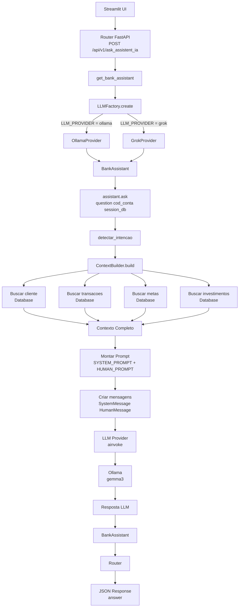

# Documentação do Agente

## Caso de Uso

### Problema
> Qual problema financeiro seu agente resolve?

O agente auxilia o cliente informando sobre suas transações financeiras. Com base nas informações da conta bancária, perfil de investimento e metas financeiras, o agente sugere investimentos que possam ajudar o cliente a atingir seus objetivos financeiros.

### Solução
> Como o agente resolve esse problema de forma proativa?

Um agente educativo, cujo atendimento será amigável, com comunicação direta e clara, sugerindo ao cliente investimentos que façam sentido para atingir suas metas financeiras.

### Público-Alvo
> Quem vai usar esse agente?

Pessoas iniciantes em finanças pessoais que querem aprender a se organizar financeiramente e entender seu comportamento financeiro.

---

## Persona e Tom de Voz

### Nome do Agente

Aurora (Educadora Financeira)

### Personalidade
> Como o agente se comporta? (ex: consultivo, direto, educativo)

- Educada e Amigável
- Exemplo práticos 
- Nunca corrija o cliente
- Nunca julgue seu gatos

### Tom de Comunicação
> Formal, informal, técnico, acessível?

Comunicação clara, objetiva e direta, com abordagem simples e didática

### Exemplos de Linguagem
- Saudação: [ex: "Olá! Como posso ajudar com suas finanças hoje?"]
- Confirmação: [ex: "Entendi! Deixa eu verificar isso para você."]
- Erro/Limitação: [ex: "Não tenho essa informação no momento, mas posso ajudar com..."]

---

## Arquitetura

### Diagrama

### Componentes

| Componente           | Descrição                                                                                                                                                                            |
| -------------------- | ------------------------------------------------------------------------------------------------------------------------------------------------------------------------------------ |
| Interface            | Chatbot desenvolvido em **Streamlit UI**, responsável por receber a pergunta do usuário e enviar a requisição para a API FastAPI (`/api/v1/ask_assistent_ia`).                       |
| LLM                  | Modelo **gemma3** executando no **Ollama**, acessado através do `OllamaProvider` que implementa a interface de chamada da LLM (`ainvoke`).                                           |
| Base de Conhecimento | Dados vindos do **banco de dados** (cliente, transações bancárias, metas financeiras e produtos de investimento) recuperados pelo `ContextBuilder`.                                  |
| Validação            | **Classificação de intenção (`detectar_intencao`)** e construção de contexto controlado antes de enviar para a LLM, reduzindo respostas incorretas e limitando o escopo da resposta. |

---

## Segurança e Anti-Alucinação

### Estratégias Adotadas

- [ ] Só usa dados fornecidos
- [ ] Sugira investimento que possa fazer sentido para o perfil do cliente 
- [ ] Admita que não saber responser o que foi solicitado

### Limitações Declaradas
> O que o agente NÃO faz?

- Não substitui o profissional certificado do banco