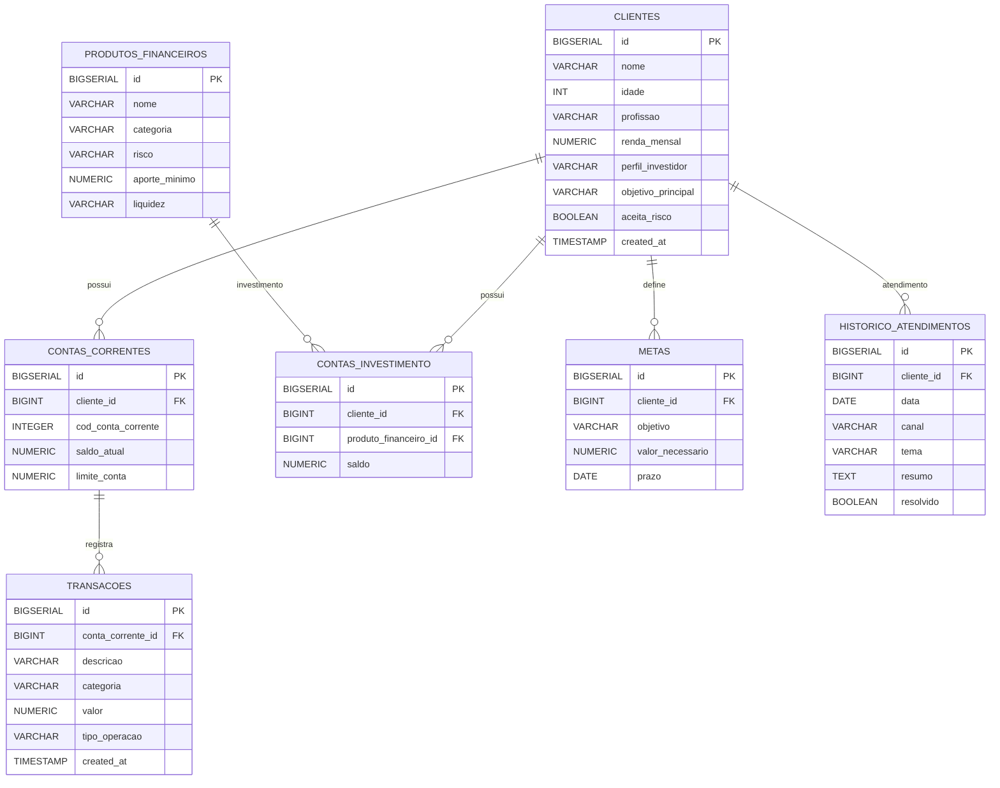

# Base de Conhecimento

## Dados Utilizados

Essa base foi estruturada a partir do conjunto de dados original disponibilizado na pasta `data\base_de_conhecimento`, com o objetivo de criar uma **base de conhecimento relacional** que permita consultas e recuperação de informações de forma estruturada.

O objetivo dessa organização é possibilitar que a agente Aurora acesse informações financeiras dos clientes por meio de consultas ao banco de dados, permitindo responder perguntas como:

- saldo da conta corrente
- últimos débitos e créditos
- histórico de transações
- perfil do cliente
- recomendações financeiras

Todos os dados presentes nessa base foram **criados de forma fictícia**, sendo utilizados exclusivamente para **fins didáticos e de demonstração**.

| Arquivo | Formato | Utilização dos dado pelo Aurora |
|---------|---------|---------------------|
| `clientes.csv` | CSV | Contextualizar as informações do cliente. |
| `contas_correntes.csv` | CSV | Contextualiza o saldo atual do cliente. | 
| `produtos_financeiros.csv` | CSV | Conhecer os produtos disponíveis para que eles possam ser ensinados ao cliente.| 
| `transacoes.csv` | CSV | Analizar padrão de gastos e ganhos do cliente e usar essas infromaçãoes de forma didática. |

> [!TIP]
> **Quer um dataset mais robusto?** Você pode utilizar datasets públicos do [Hugging Face](https://huggingface.co/datasets) relacionados a finanças, desde que sejam adequados ao contexto do desafio.


## Adaptações nos Dados

> Você modificou ou expandiu os dados mockados? Descreva aqui.

A partir da base de dados fornecida, que se encontra originalmente na pasta data, foi modelado um banco de dados relacional, no qual foi possível estruturar novos dados para fins didáticos. Os novos dados gerados para a base de conehcimento da agente Aurora, encontra-se na pasta data/base_de_conhecimento.



---

---

## Estratégia de Integração

### Como os dados são carregados?
> Descreva como seu agente acessa a base de conhecimento.
O agente acessa a base de conhecimento por meio de consultas a um banco de dados relacional integrado à API desenvolvida com FastAPI. Quando uma pergunta é recebida, o sistema realiza consultas dinâmicas ao banco utilizando SQLAlchemy, por meio do componente ContextBuilder. Esse componente busca informações relevantes em tabelas como clientes, transações, metas, contas de investimento e produtos financeiros. Os dados retornados dessas consultas são organizados em um objeto de contexto estruturado, geralmente no formato de dicionário ou JSON. Em seguida, esse contexto é inserido dinamicamente em um template de prompt que será enviado ao modelo de linguagem, permitindo que a resposta gerada utilize informações que
está armazenadas no sistema.

### Como os dados são usados no prompt?
> Os dados vão no system prompt? São consultados dinamicamente?

Os dados não são incluídos no system prompt. Em vez disso, eles são consultados dinamicamente no banco de dados e injetados em um template de prompt do tipo human_prompt. Dessa forma, o agente recebe a pergunta do usuário e, antes de enviar a requisição ao modelo de linguagem, o sistema recupera informações relevantes da base de dados — como dados do cliente, transações, metas e produtos financeiros — por meio de consultas realizadas pelo ContextBuilder utilizando SQLAlchemy na API construída com FastAPI. Esses dados são organizados em um objeto de contexto estruturado (por exemplo, um dicionário ou JSON) e inseridos dinamicamente no human_prompt. Assim, o agente envia ao modelo de linguagem um prompt enriquecido com informações atualizadas do banco de dados, garantindo que a resposta seja gerada com o máximo de contexto possível.

*HUMAN_PROMPT*:
```
"""
### PERGUNTA
{PERGUNTA}

### DADOS_CLIENTE
{DADOS_CLIENTE}

### TRANSACOES
{TRANSACOES_BANCARIAS}

### METAS
{METAS}

### INVESTIMENTOS   
{PRODUTOS_DISPONIVEIS}

INSTRUÇÃO:
Use apenas os dados acima para responder à pergunta.

"""
```

---

## Exemplo de Contexto Montado

> Mostre um exemplo de como os dados são formatados para o agente.

```text
[HUMAN PROMPT]

### PERGUNTA
Aurora como assistente financeira e com base nos meus últimos gastos como poderia organizar a minha vida financeira ?


### DADOS_CLIENTE
{
  "nome": "João Silva",
  "idade": 35,
  "perfil_investidor": "moderado",
  "aceita_risco": true,
  "renda_mensal": 12000.0,
  "saldo_atual": 68466.0
}


### TRANSACOES
[
  {
    "descricao": "Viagem curta",
    "categoria": "lazer",
    "valor": 650.0,
    "tipo_operacao": "debito",
    "created_at": "2026-03-27T00:00:00"
  },
  {
    "descricao": "Conta de água",
    "categoria": "conta_agua",
    "valor": 118.0,
    "tipo_operacao": "debito",
    "created_at": "2026-03-22T00:00:00"
  },
  {
    "descricao": "Conta de luz",
    "categoria": "conta_luz",
    "valor": 220.0,
    "tipo_operacao": "debito",
    "created_at": "2026-03-20T00:00:00"
  },
  {
    "descricao": "Farmácia",
    "categoria": "farmacia",
    "valor": 150.0,
    "tipo_operacao": "debito",
    "created_at": "2026-03-18T00:00:00"
  },
  {
    "descricao": "Pagamento IPVA",
    "categoria": "ipva",
    "valor": 1600.0,
    "tipo_operacao": "debito",
    "created_at": "2026-03-15T00:00:00"
  },
  {
    "descricao": "Combustível carro",
    "categoria": "combustivel",
    "valor": 610.0,
    "tipo_operacao": "debito",
    "created_at": "2026-03-15T00:00:00"
  },
  {
    "descricao": "Supermercado mensal",
    "categoria": "supermercado",
    "valor": 930.0,
    "tipo_operacao": "debito",
    "created_at": "2026-03-12T00:00:00"
  },
  {
    "descricao": "Projeto estrutural",
    "categoria": "renda_extra",
    "valor": 2100.0,
    "tipo_operacao": "credito",
    "created_at": "2026-03-10T00:00:00"
  },
  {
    "descricao": "Pagamento IPTU",
    "categoria": "iptu",
    "valor": 850.0,
    "tipo_operacao": "debito",
    "created_at": "2026-03-10T00:00:00"
  },
  {
    "descricao": "Aluguel apartamento",
    "categoria": "aluguel",
    "valor": 3200.0,
    "tipo_operacao": "debito",
    "created_at": "2026-03-08T00:00:00"
  },
  {
    "descricao": "Salário mensal Março",
    "categoria": "salario",
    "valor": 12000.0,
    "tipo_operacao": "credito",
    "created_at": "2026-03-05T00:00:00"
  }
]


### METAS
null

### INVESTIMENTOS
null


INSTRUÇÃO:
Use apenas os dados acima para responder à pergunta.
```
