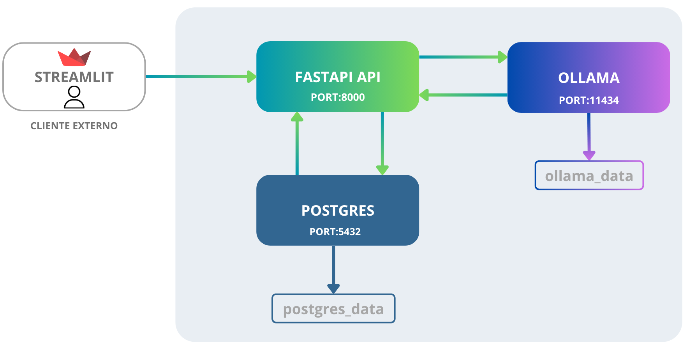
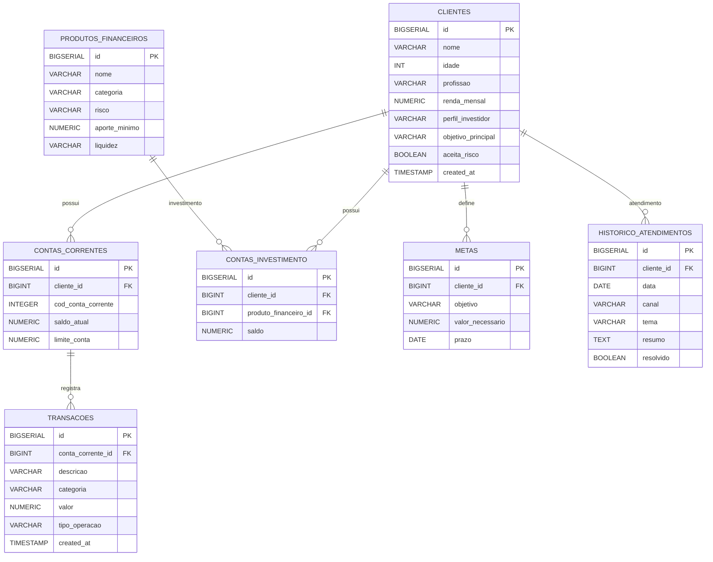
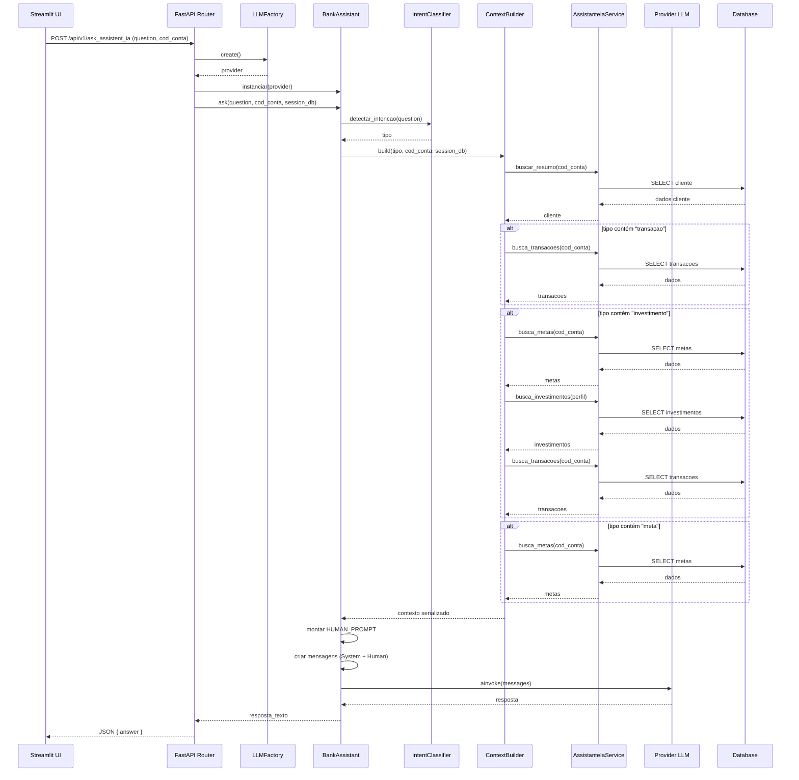
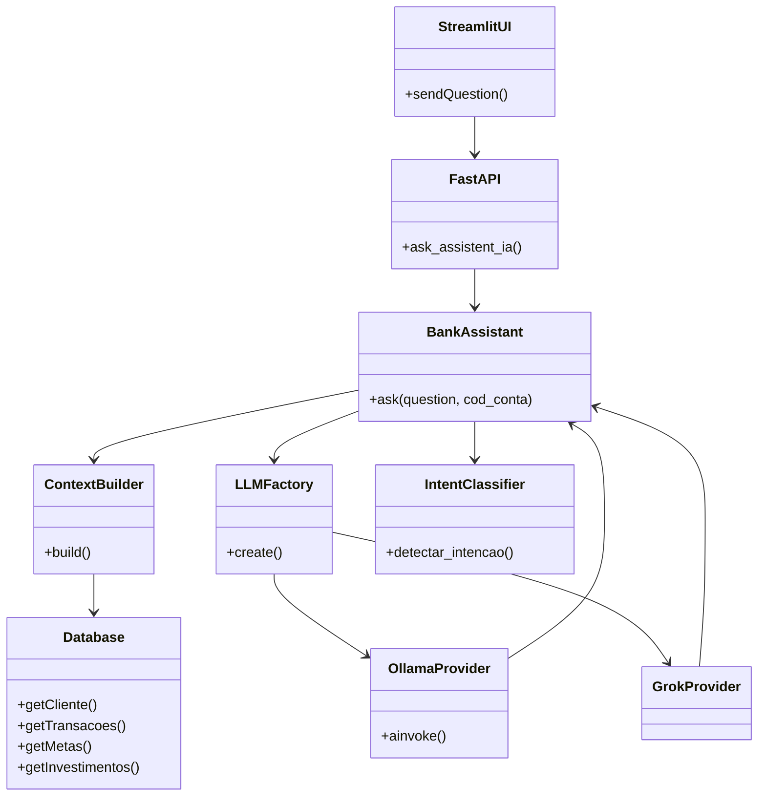

# 🚀 Aurora - Assistente Financeira com IA

## 🚀 Visão Geral

Aurora é uma assistente financeira inteligente que utiliza modelos de linguagem (LLM) integrados a um banco de dados relacional para fornecer respostas personalizadas com base no contexto financeiro do cliente. A aplicação combina FastAPI, PostgreSQL, Ollama (LLM local) e Streamlit para criar um chatbot capaz de analisar transações, metas e perfil do usuário, entregando respostas seguras, contextualizadas e sem alucinação.

### Arquitetura do projeto


---

## 1. 🗄️ Modelagem do Banco de Dados

A partir de uma base inicial em arquivos CSV e JSON: foi realizada a **modelagem de um banco relacional** para permitir:

### Dado Fornecidos:

historico_atendimento.csv
```csv
data,canal,tema,resumo,resolvido
2025-09-15,chat,CDB,Cliente perguntou sobre rentabilidade e prazos,sim
2025-09-22,telefone,Problema no app,Erro ao visualizar extrato foi corrigido,sim
2025-10-01,chat,Tesouro Selic,Cliente pediu explicação sobre o funcionamento do Tesouro Direto,sim
2025-10-12,chat,Metas financeiras,Cliente acompanhou o progresso da reserva de emergência,sim
2025-10-25,email,Atualização cadastral,Cliente atualizou e-mail e telefone,sim

```

perfil_investidor.json 
```json
{
  "nome": "João Silva",
  "idade": 32,
  "profissao": "Analista de Sistemas",
  "renda_mensal": 5000.00,
  "perfil_investidor": "moderado",
  "objetivo_principal": "Construir reserva de emergência",
  "patrimonio_total": 15000.00,
  "reserva_emergencia_atual": 10000.00,
  "aceita_risco": false,
  "metas": [
    {
      "meta": "Completar reserva de emergência",
      "valor_necessario": 15000.00,
      "prazo": "2026-06"
    },
    {
      "meta": "Entrada do apartamento",
      "valor_necessario": 50000.00,
      "prazo": "2027-12"
    }
  ]
}

```
produtos_financeiros.json

```json
[
  {
    "nome": "Tesouro Selic",
    "categoria": "renda_fixa",
    "risco": "baixo",
    "rentabilidade": "100% da Selic",
    "aporte_minimo": 30.00,
    "indicado_para": "Reserva de emergência e iniciantes"
  },
  {
    "nome": "CDB Liquidez Diária",
    "categoria": "renda_fixa",
    "risco": "baixo",
    "rentabilidade": "102% do CDI",
    "aporte_minimo": 100.00,
    "indicado_para": "Quem busca segurança com rendimento diário"
  },
  {
    "nome": "LCI/LCA",
    "categoria": "renda_fixa",
    "risco": "baixo",
    "rentabilidade": "95% do CDI",
    "aporte_minimo": 1000.00,
    "indicado_para": "Quem pode esperar 90 dias (isento de IR)"
  },
  {
    "nome": "Fundo Imobiliarios (FII)",
    "categoria": "fundo",
    "risco": "medio",
    "rentabilidade": "Dividend yield (DY) costuma ficar entre 6% a 12% ao ano",
    "aporte_minimo": 100.00,
    "indicado_para": "Perfil moderado que busca diversificação e recorrencia mmensal"
  },
  {
    "nome": "Fundo de Ações",
    "categoria": "fundo",
    "risco": "alto",
    "rentabilidade": "Variável",
    "aporte_minimo": 100.00,
    "indicado_para": "Perfil arrojado com foco no longo prazo"
  }
]
```
transacoes.csv
```
data,descricao,categoria,valor,tipo
2025-10-01,Salário,receita,5000.00,entrada
2025-10-02,Aluguel,moradia,1200.00,saida
2025-10-03,Supermercado,alimentacao,450.00,saida
2025-10-05,Netflix,lazer,55.90,saida
2025-10-07,Farmácia,saude,89.00,saida
2025-10-10,Restaurante,alimentacao,120.00,saida
2025-10-12,Uber,transporte,45.00,saida
2025-10-15,Conta de Luz,moradia,180.00,saida
2025-10-20,Academia,saude,99.00,saida
2025-10-25,Combustível,transporte,250.00,saida

```

foi realizada a **modelagem de um banco relacional** para permitir:

* Relacionamento entre dados
* Consultas eficientes
* Escalabilidade
* Automação e consistência de dados via triggers

### 📌 Importância das Triggers

No projeto, foram criadas **triggers no banco de dados** para automatizar processos críticos e garantir integridade financeira:

#### Atualização automática de saldo
Toda vez que uma transação é inserida na tabela `transacoes`, a trigger `trg_atualiza_saldo` executa a função `fn_atualiza_saldo` que:
- Incrementa o saldo da conta em caso de crédito
- Decrementa o saldo em caso de débito
- Valida se o saldo + limite da conta é suficiente, evitando débitos indevidos

#### Criação automática de conta corrente
Quando um novo cliente é inserido na tabela `clientes`, a trigger `trg_criar_conta_corrente` cria automaticamente uma conta corrente associada, garantindo que todo cliente tenha sua conta pronta para transações.

> ✅ Com isso, asseguramos integridade, evitamos inconsistências manuais e reduzimos a complexidade da lógica na camada da aplicação.
### 📊 Entidades principais

* **Clientes** → dados do usuário
* **Contas Correntes** → saldo
* **Transações** → histórico financeiro
* **Produtos Financeiros** → investimentos disponíveis
* **Metas** → objetivos do cliente
* **Contas de Investimento** → carteira do cliente
* **Histórico de Atendimento** → interações passadas

Essa modelagem permite análises como:

* Último débito/crédito
* Padrão de gastos
* Sugestões de investimento



---

## 2. ⚙️ API com FastAPI

A aplicação possui uma API responsável por:

* Orquestrar a lógica de negócio
* Consultar o banco de dados
* Integrar com a LLM

### 📁 Estrutura do Projeto

```
├── api
│   ├── core → configuração e base do sistema
│   ├── llm → integração com IA
│   │   ├── factory → criação do provider
│   │   ├── prompt → templates de prompt
│   │   ├── provider → integração com Ollama/Grok
│   │   ├── services → regras da IA
│   │   │   ├── bank_assistente.py
│   │   │   ├── context_builder.py
│   │   │   └── intent_classifier.py
│   │
│   ├── models → modelos do banco
│   ├── repository → acesso a dados
│   ├── router → endpoints
│   ├── schemas → validação (Pydantic)
│   └── service → regras de negócio
```

### 🔗 Endpoint principal

```
POST /api/v1/ask_assistent_ia
```

Responsável por receber a pergunta do usuário e retornar a resposta da IA.

---

## 3. 🤖 LLM com Ollama

A Aurora utiliza o modelo **gemma3 via Ollama**, permitindo execução local.

### 🔧 Componentes

* `LLMFactory` → define qual provider usar
* `OllamaProvider` → integração com modelo local
* `BankAssistant` → orquestra a resposta

### 🧠 Funcionamento

* Recebe pergunta
* Injeta contexto no prompt
* Envia para LLM
* Retorna resposta

---

## 4. 💻 Streamlit (Interface)

O Streamlit é responsável por:

* Interface do usuário
* Envio de perguntas para API
* Exibição das respostas

### 🔄 Fluxo

1. Usuário digita pergunta
2. Streamlit chama API
3. API processa
4. Retorna resposta
5. UI exibe resposta


---

## 5. 💬 Funcionamento do Chatbot

### 🔄 Fluxo completo

1. Usuário envia pergunta
2. API recebe requisição
3. `intent_classifier` identifica intenção
4. `ContextBuilder` busca dados no banco
5. Contexto é montado
6. Prompt é gerado
7. LLM processa
8. Resposta retorna ao usuário

#### Diagrama De Sequência



### Diagrama de Classes



---


### 💡 Exemplo de Perguntas

* Qual meu saldo atual?
* Qual foi meu último gasto?
* Quanto gastei com supermercado?
* Tenho metas cadastradas?
* Qual investimento combina comigo?

---

### 🧾 Exemplo de Resposta

"Seu saldo atual é de 68466.0. Seu último gasto foi com supermercado no valor de 930.0."

---

## 🎯 Conclusão

A Aurora combina:

* Banco relacional
* API estruturada
* LLM local
* Interface interativa

para criar uma solução escalável, segura e preparada para aplicações reais de IA no setor financeiro.

---
