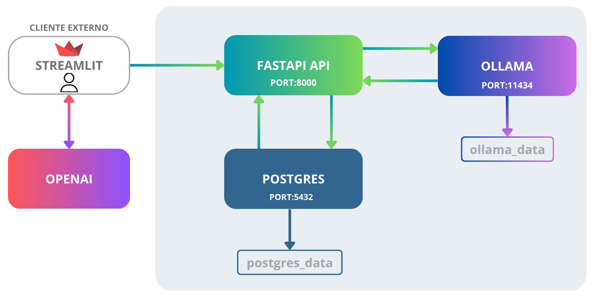
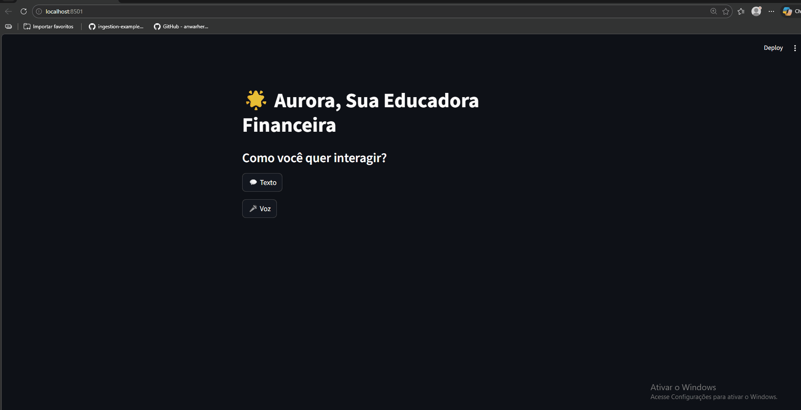

# 🚀 Visão Geral Do Projeto

Este projeto implementa uma assistente financeira inteligente (Aurora) utilizando modelos de linguagem (LLM) executados localmente com Ollama, backend em FastAPI e interface construída com Streamlit.

A aplicação permite que usuários consultem informações financeiras por meio de linguagem natural, com base em dados estruturados armazenados no banco de dados.

---

## 🏢 Arquitetura do projeto



A arquitetura é baseada em containers orquestrados com Docker Compose e é composta pelos seguintes serviços:

### 🔹 Componentes principais

* **Streamlit (Frontend)**
  * Interface do usuário  
  * Responsável pela interação com o usuário (chat)

* **FastAPI (Backend)**
  * Gerencia as requisições  
  * Contém as regras de negócio  
  * Integra com banco de dados e LLM  

* **Ollama (LLM)**
  * Executa o modelo de linguagem (ex: Gemma)  
  * Responsável pela geração das respostas  

* **PostgreSQL**
  * Armazena os dados financeiros do usuário  
  * Fonte de dados da aplicação  

* **Volumes Docker**
  * `postgres_data`: persistência do banco  
  * `ollama_data`: persistência dos modelos  

---

## 🚀 Como Executar o Projeto

### 1️⃣ Acessar o diretório do projeto

```bash
cd src
```

---

### 2️⃣ Criar o arquivo de variáveis de ambiente

Na raiz da pasta `src`, crie um arquivo `.env`.

Você pode utilizar o arquivo `env.example` como referência:

```bash
cp env.example .env
```

Depois disso, revise o arquivo `.env` e ajuste os valores conforme necessário.

---

### 3️⃣ Build e inicialização dos containers

```bash
docker compose up --build
```

---

### 4️⃣ Inicializar o modelo no Ollama

```bash
docker exec -ti dio_ollama ollama run gemma3
```

---

### 5️⃣ Inserir os dados da base de conhecimento

O script SQL está disponível em:

```
data/sql/inserir_dados.sql
```

#### Passos:

1. Acesse o PostgreSQL via:
   - pgAdmin  
   - DBeaver  
   - ou outro cliente  

2. Utilize as credenciais do `.env`

3. Execute o script SQL no banco

---

## 🌐 Acessar a Aplicação

### Interface da Assistente Aurora

```
http://localhost:8501
```



---

### Documentação da API (Swagger)

```
http://127.0.0.1:8000/docs
```

---

## 🔗 Endpoints da API

A API fornece endpoints para gerenciamento de clientes, contas e interação com a assistente inteligente.

---

### 👤 Cliente

#### ➤ Criar cliente

**POST** `/api/v1/`

```json
{
  "nome": "João Silva",
  "idade": 30,
  "profissao": "Desenvolvedor",
  "renda_mensal": 5000,
  "perfil_investidor": "Moderado",
  "objetivo_principal": "Aposentadoria",
  "aceita_risco": true
}
```

---

#### ➤ Buscar cliente

**GET** `/api/v1/?cod_account=1`

| Parâmetro    | Tipo | Obrigatório |
|-------------|------|------------|
| cod_account | int  | ✅ Sim      |

---

### 💳 Conta

#### ➤ Buscar dados da conta (cliente + transações)

**GET** `/api/v1/{cod_conta}?cod_account=1`

| Parâmetro    | Tipo | Obrigatório |
|-------------|------|------------|
| cod_account | int  | ✅ Sim      |

---

#### 📥 Exemplo de resposta

```json
{
  "client": {
    "nome": "João Silva",
    "idade": 30,
    "renda_mensal": 5000,
    "objetivo_principal": "Aposentadoria",
    "created_at": "2025-01-01T10:00:00",
    "profissao": "Desenvolvedor",
    "perfil_investidor": "Moderado",
    "aceita_risco": true
  },
  "transection": [
    {
      "id": 1,
      "categoria": "Alimentação",
      "descricao": "Supermercado",
      "tipo_operacao": "debito",
      "conta_corrente_id": 1,
      "valor": 150.0,
      "created_at": "2025-01-10T12:00:00"
    }
  ]
}
```

---

### 🤖 Assistente IA (Aurora)

#### ➤ Fazer pergunta para a assistente

**POST** `/api/v1/ask_assistent_ia`

```json
{
  "question": "Quanto gastei esse mês?",
  "cod_conta": 1
}
```

---

### ⚠️ Possíveis erros

#### 422 - Validation Error

```json
{
  "detail": [
    {
      "loc": ["body", "field"],
      "msg": "erro de validação",
      "type": "value_error"
    }
  ]
}
```

---

## 📌 Observações

- Todos os endpoints utilizam **JSON**  
- A API segue padrão **REST**  
- A assistente utiliza dados reais da conta para responder perguntas  
- A IA roda localmente via **Ollama**, garantindo privacidade  
